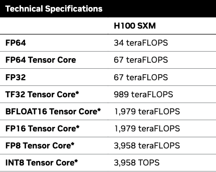

Some notes on FLOPs and how to think about compute bound vs memory bound regimes using FP8 and H100 numbers.

These are a set of notes based on this [blog post](https://jax-ml.github.io/scaling-book/roofline/)

# A FLOP

- FLOP => Floating Point Operation
- FLOPs => Floating Point Operations Per Second

> [!note]
> People tend to mix up FLOPS and FLOPs and they usually mean the same thing. Keep that in mind when you see any numbers around FLOPS or FLOPS/second. We'll be using FLOPs to mean "Floating Point Operations" and FLOPs/second to mean "Floating Point Operations Per Second" just for clarity here.

FLOPs are more complex and resource-intensive when compared to integer operations. We usually look at 32-bit (FP32), 16-bit (BF16), 8-bit (FP8) operations.

Simple reference for powers of 10 and their prefixes: https://ned.ipac.caltech.edu/level5/Units/frames.html

# Computation Time and Communication Time

$$
T\_{math} = \frac{\text{Computation FLOPs}}{\text{Accelerator FLOPs/second}}
$$

is the time in seconds it takes to complete a computation

$$
T\_{comms} = \frac{\text{Communication Bytes}}{\text{Memory BW Bytes/second}}
$$

is the time in seconds it takes to complete a communication operation

We can usually overlap communication and computation time (think DSV3 MoE all-to-all comms overlapped with attention/MoE computation). If we assume perfect overlap, the lower bound of a computation is

$$
\text{Lower Bound} = \max(T\_{math}, T\_{comms})
$$

The upper bound (which is no overlap) is

$$
\text{Upper Bound} = T\_{math} + T\_{comms}
$$

Assuming perfect overlap - when T_math > T_comms, we are in a compute bound regime. When T_math < T_comms we are in a memory bound regime. For example, in prefill we are computing attention (which is an expensive O(n^2) operation) for a large sequence in parallel. This is a high FLOPs activity and a low communication activity. In decode - we are computing attention for new tokens (assuming a KV cache) but moving weights back and forth between the HBM and compute cores. This is a low FLOPs activity and a high communication activity.

# Arithmetic Intensity

Definition: the ration of total FLOPs to the number of bytes communicated. FLOPs per 1 byte.

$$
\text{Arithmetic Intensity} = \frac{\text{Computation FLOPs}}{\text{Communication Bytes}}
$$

## Looking at NVIDIA H100 SXM



Looking at FP8 Tensor Core we have `3958 TFLOPs/second` and a `3.35 TB/s bw`. To figure out arithmetic intensity to achieve peak FLOPs/second - we can do the following because both are 10^12.

$$
\text{Arithmetic Intensity} = \frac{3958 \text{ TFLOPs/second}}{3.35 \text{ TB/s}} = 1,182 \text{ FLOPs/byte}
$$

If an algorithm has a lower arithmetic intensity (again which means it has less than 1182 FLOPS performed per 1 byte of data moved), we will be in a memory bound regime. But if an algorithm requires more than 1182 FLOPS performed per 1 byte of data moved, we will be in a compute bound regime.

### FP8 dot product

Say we have 2 vectors in FP8 precision of length N.

$$
\vec{x} \cdot \vec{y} = \text{fp8}[N] \times \text{fp8}[N] \rightarrow \text{fp8}[1]
$$

Here's exactly what happens:

1. Load 2 vectors in from memory. Each vector is length N and each element is 1 byte. So we load in total 2N bytes
2. We compute dot product. There are N multiply operations and N-1 add operations. So we perform N+N-1 = 2N-1 FLOPs.
3. Write back a single FP8 value. So write back 1 byte.

$$
\text{arithmetic intensity} = \frac{2N - 1}{2N + 1}
$$

So the arithmetic intensity of FP8 dot product is 1 as N -> infinity. In FP16, this value is 0.5. So we have a higher arithmetic intensity. This makes intuitive sense. Dot product is a very trivial operation so it makes sense that when we compare this to peak intensity of an H100 - we will be memory bound.

### FP8 matrix multiplication

Say we have the following matricies

$$
X: \text{fp8}[B, D]
$$

$$
Y: \text{fp8}[D, F]
$$

$$
Z: \text{fp8}[B, F]
$$

We want to compute X \* Y = Z.

We have this many multiplications:

$$
BFD
$$

And this many additions:

$$
BF \times (D-1)
$$

This simplifies to the following which is the general formula for matrix multiplication FLOPs:

$$
BF(2D-1)
$$

This might not make the most sense but I suggest trying this out on paper with a [2,3] \* [3,2] matrix multiplication.

For communication we have to load in BD + DF bytes and write back BF bytes.

$$
\text{Arithmetic Intensity} = \frac{BF(2D-1)}{BD + DF + BF}
$$

We can overall simplify this to the following in order to make some assumptions:

$$
\text{Arithmetic Intensity} = \frac{2BDF}{BD + DF + BF}
$$

Say that `B` is our batch size. If we assume a small batch size, we can show that BD and FB are going to be much smaller than DF which will allow us to simplify that equation to just `B`.

Therefore - the arithmetic intensity of a matrix multiplication (with these simplifications for transformers) is simply `B`. Going back to the H100 - our peak arithmetic intensity is 1182 FLOPs/byte. This means that if `B` is greater than 1182, we will be in a compute bound regime. If `B` is less than 1182, we will be in a memory bound regime. I.e our batch size needs to be greater than 1182 in FP8 otherwise we are memory bound.

> [!note]
> Quantizations and casting affects this math. For example, if we're using INT4 quantization instead of FP8, we would need to adjust the bytes loaded/stored accordingly.

# Multi-GPU/node communication

We need to change some math when we think about multi GPU matmuls. This is the most important since most of our work is primarily done across multiple nodes these days.

Going back to same matmul example as before.

$$
X: \text{fp8}[B, D]
$$

$$
Y: \text{fp8}[D, F]
$$

$$
Z: \text{fp8}[B, F]
$$

Say we have 2 H100 GPUs (3958 TFLOPs/second (10e12) for FP8 and 900 GB/s (10e9) BW via NVLink). And lets say we have split the matmul evenly across the D dimension. This is how code would look (without any GPUs or NCCL operations, etc). At the moment I am too lazy to make this general so we'll stick with 2 devices:

```python
import numpy as np

def shard_and_multiply_over_d_dim_2_devices(X: np.ndarray, Y: np.ndarray):
    """
    Matmul 2 matricies across 2 devices
    """

    B, D = X.shape
    D2, F = Y.shape

    assert D == D2, "Inner dimensions must match for matrix multiplication"

    gpu1_d = D // 2
    gpu2_d = D2 // 2

    print(f"GPU1 will multiply a matrix of size {B}, {gpu1_d} by {gpu2_d}, {F}")
    print(f"GPU2 will multiply a matrix of size {B}, {D - gpu1_d} by {D2 - gpu2_d}, {F}")

    # Shard X and Y
    # access all rows of X but only gpu1_d columns
    X_gpu1 = X[: , :gpu1_d]
    # access only gpu1_d rows but all columns
    Y_gpu1 = Y[:gpu1_d, :]

    X_gpu2 = X[:, gpu1_d:]
    Y_gpu2 = Y[gpu1_d: , :]

    return g1 + g2

X = np.array([[1, 2, 3], [4, 5, 6]])
Y = np.array([[1, 2], [3, 4], [5, 6]])

res = shard_and_multiply_over_d_dim_2_devices(X,Y)

assert np.all(res == X @ Y), "The results are not the same"

X = np.random.randint(0,10, size=(947, 332))
Y = np.random.randint(0,10, size=(332, 468))

res = shard_and_multiply_over_d_dim_2_devices(X,Y)
assert np.all(res == X @ Y), "The results are not the same"
```

T_math is now half because we are 2 GPUs.

$$
T_{math} = \frac{2BDF}{2 \times 3958 \times 10e12 \text{ FLOPs/second}}
$$

Cancel the 2 and you're left with

$$
T_{math} = \frac{BDF}{3958 \times 10e12 \text{ FLOPs/second}}
$$

T_comms is the comms time between chips. We send a matrix sized `BF`

$$
T_{comms} = \frac{BF}{900 \times 10e9 \text{ bytes/second}}
$$

Looking at the arithmetic intensity:

$$
intensity = \frac{BDF}{BF} = D
$$

which is just D! Our H100 peak FP8 arithmetic intensity (for 2 H100s over NVLink BW) is is

$$
\frac{3958 \text{ TFLOPs/second}}{900 \text{ GB/second}} = 4397.78 \text{ FLOPs/byte}
$$

So we need `D` to be greater than 4397 otherwise we are memory bound. Batch size is not our limiting factor here anymore because are not thinking about our chip local HBM as our intensity metric. It is now the computation power of 2 H100s with the BW being NVLink.
