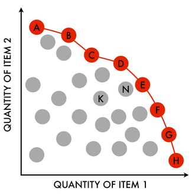
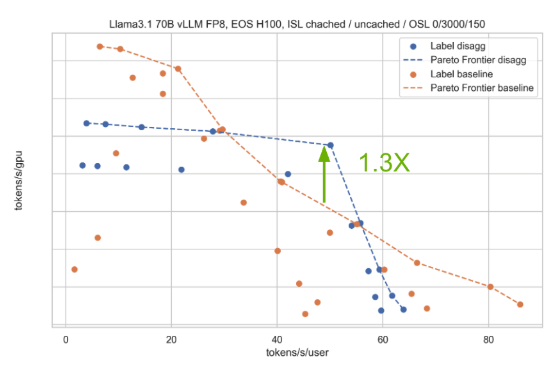

# What is a Pareto Frontier?

The Pareto frontier represents the boundary of what’s possible when optimizing for two (or more) competing objectives. Any point on the frontier is Pareto-optimal: you can’t improve one dimension without making the other worse.

The red curve defines the efficient tradeoff space. For example, moving from point B to C gives you more of Objective 1 — but only at the cost of Objective 2. If you're sitting on point K or N inside the curve, you're not using your resources effectively: you're strictly worse off in both dimensions than someone on the frontier.

# Inference from a Pareto Perspective

When we talk about serving LLMs, we are always navigating a tradeoff between two core performance metrics:

| Axis              | What it Really Measures                                          | Units                  |
| ----------------- | ---------------------------------------------------------------- | ---------------------- |
| **X: Latency**    | How quickly _each individual user_ gets their token(s)           | tokens / second / user |
| **Y: Throughput** | How many total tokens your system generates per second _per GPU_ | tokens / second / GPU  |

In other words:

- Latency tells you how fast a single request flows end-to-end.
- Throughput tells you how much aggregate work you’re getting out of your compute.

> [!note]
> You might see throughput on the X and latency on the Y in some graphs. I'll be using the convention of throughput@latency because that's primarily how we think about inference performance.

If you draw this out — latency on the x-axis, throughput on the y-axis — you get a performance frontier that looks something like this:

Let's unpack the chart:

- From the title we see that we're running Llama 3.1 70B on H100s
- We're benchmarking an input sequence length (ISL) for 3000 tokens and output sequence length (OSL) of 150 tokens. This is a 20:1 ratio. We can see that we're interested an input sequence heavy benchmark
- We've got 2 lines plotted - aggregated vs disaggregated inference (more on this in future blog posts)
