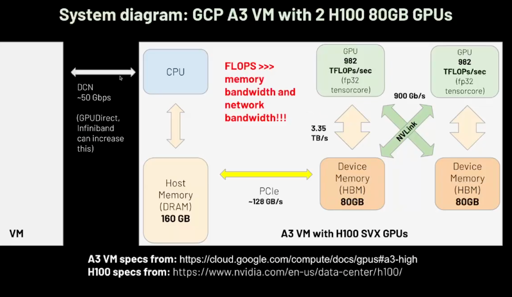

TLDR - Tensor, pipeline, and data parallel all affect model inference performance differently. Usually, pipeline parallelism increases throughput, tensor parallelism decreases latency, and data parallelism is simply adding another model replica. Recently - with the introduction of MoE models like DeepSeek-R1, we also consider some "sub-forms" of parallelism like expert parallelism and data parallelism for attention.

# Why we need parallelism

Why We Need Parallelism
Neural networks operate on tensors — large, multi-dimensional arrays of numbers. In the case of language models, these tensors often represent sequences of text. Each word in a sentence gets converted into one or more slices of a tensor, which is then passed through the model to generate other tensors — hidden states, attention scores, logits — until eventually, a final output is produced.

## Everything takes memory

All of these tensors — the input embeddings, the intermediate activations, the attention keys and values, the model weights themselves — must be stored in GPU memory. And the amount of memory required scales with:

- The input length (e.g., how long the prompt is),
- The batch size (how many requests you handle at once),
- The model size (parameter count × precision),

Clearly, one **GPU is not enough** — at least not for most real-world serving workloads. To make use of multiple GPUs, we have to split the work across them — and get them to coordinate. This isn’t as simple as just "run the same code on each card." We have to decide what to split, how to split it, and how to stitch it all back together without bottlenecks.

At a high level, there are three major ways to do this:

- **Tensor Parallelism**: Split each matrix across GPUs, so they work together on the same operation.

- **Pipeline Parallelism**: Split the model layers across GPUs — like an assembly line.

- **Data Parallelism**: Replicate the whole model across GPUs and run different inputs on each one.

When we talk about MoE models like DeepSeek-R1, we also consider some "sub-forms" of parallelism like expert parallelism and data parallelism for attention. We'll cover these in more detail later.

# Setup and Constants

All forms of parallelism are affected by a large amount of things like batch size, sequence lenght, GPU interconnect, etc all play a role. To simplify our discussion - we'll be using the following values:

$$
I: \text{fp8}[10, 7168]
$$

$$
W: \text{fp8}[7168, 7168]
$$

For our hardware - we'll be using numbers from the GCP A3 VM spec which contains 2 H100 GPUs connected via NVLink. In FP8, the H100 can compute 3958 TFLOPs/second and contains a 3.35 TB/s bw. NVLink interconect is 900 GB/s. Here's a toy diagram from the Eluther AI ML Performance youtube video:

# Tensor Parallelism

At a high level, tensor parallelism splits a model horizontally across multiple GPUs. There's 2 ways to approach this: `row-wise` and `column-wise`. Each GPU now handles a partition of the computation. Lets take our matricies `I` and `W` and split them across 2 GPUs. On a single GPU, we would have the trivial computation `O = I @ W`.

In the TP case - we shard our matrix along the inner dimension. Since we have 2 GPUs, each GPU will contain a shard of `I` sized `[10, 3584]` and `W` sized `[3584, 7168]`.

# Pipeline Parallelism

# Data Parallelism (replicas)

# Attention Data Parallelism

# Expert Parallelism

## Wide EP

$$
$$
