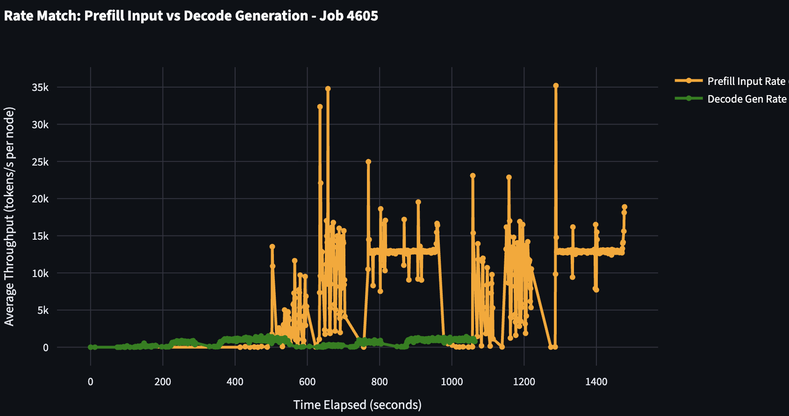

**TLDR:** Prefill and decode are usually optimized separately. When you care about end to end performance in a disaggregated setup, you need a way to reconcile the difference in their observed throughput. Rate matching gives you a simple method to decide how many prefill and decode workers you need.

# Introduction to rate matching

Disaggregated serving splits the request pipeline into two phases: the prefill phase that processes the prompt and generates KV cache and the decode phase that generates tokens. This architecture is supported in all of the major inference engines and can provide significant performance improvements for certain workloads.

Whenever someon's looking to deploy a model using disaggregation, a common question that comes up is: **how do I know the right number of prefill workers and decode workers to provision**. Because optimal performance is so workload dependent, picking the right ratio is not always straightforward.

The goal of this post is to give a simple, lightweight introduction to rate matching, and outline steps that you can take to figure out the right number of prefill and decode workers for your workload. 

If you want a broader intro to disaggregation, this [doc](https://docs.nvidia.com/dynamo/latest/design_docs/disagg_serving.html) from the NVIDIA Dynamo repository is a good high level introduction. 

# Gathering a baseline

The first step to any sort of benchmarking is to gather a baseline. The simplest way to do this is to run your engine in aggregated mode. This will give you a sense of what your baseline performance is and you can use this as a starting point. Note that aggregation suffers from prefill injection latency which you will not face in a disaggregated setup. 

# Isolating Prefill and Decode Performance

Next, you want to isolate the performance of the prefill and decode stages alone and get a sense for what peak performance looks like. This is also a good time to dive into your engine setup as well. In order to measure prefill performance, you want to setup a prefill-dominated workload. This means you want to set your input sequence length (ISL) to be similar to your expected request but output sequence length (OSL) to be something small (say 5). Same for decode, you want to set your ISL to be something small but reasonable in order to simulate a single prefill step and set your OSL to be similar to your expected request.

This step will probably take the longest as this is the step where you will need to tune your engine to get the best performance. Engines like SGLang and TRT-LLM have a variety of flags (chunked prefill, attention backend, mixture-of-experts kernels, etc) that can widely affect performance and its a good idea to setup some sweeping infrastructure to help you figure out the best configs.

At the end of this step, you should have a set of configurations for peak prefill and peak decode performance. Rate matching is all about reconciling these two.

# Rate Matching

Say you have the following numbers:

- Your workload has an ISL of 1000 and OSL of 1000 tokens.
- Your best prefill config uses dp-attention and expert parallelism of 8 (DEP8) and peaks at **13k TPS per GPU**.
- Your best decode config uses dp-attention and expert parallelism of 48 (DEP48) and peaks at **9k TPS per GPU**.

Our first step is figuring out how many requests per second each prefill and decode server can handle. Since ISL is 1000, 1000 tokens per second corresponds to 1 request per second. And since we know how many GPUs each server takes, we can easily convert TPS per GPU to TPS per server

- Prefill server throughput: `13k * 8 GPUs = 104k TPS per server`  
  Which is about `104 requests per second` at ISL 1000.
- Decode server throughput: `9k * 48 GPUs = 432k TPS per server`  
  Which is about `432 requests per second` at OSL 1000.

Immediatly we can see that decode is much faster than prefill and prefill is our bottleneck. In this case it makes sense to increase to 3 prefill servers in order to match the decode throughput closer. 

You can also take logs of a benchmark where you run 1P vs 1D with your expected ISL and OSL and plot the input tok/s (prefill) vs output tok/s (decode) from each engine. Here's an example graph from SGLang:

Here you can see that decode throughput is not able to keep up with the prefill throughput! Additionally, you can look at the quueuing on the decode side which shows that prefill is not able to "feed" the decode server with enough load to keep it busy!

Now here's an example of a good rate match: 

Here you can see that the decode throughput is able to keep up with prefill throughput and the decode queue is much smaller!

