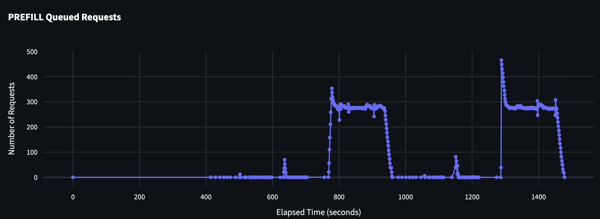
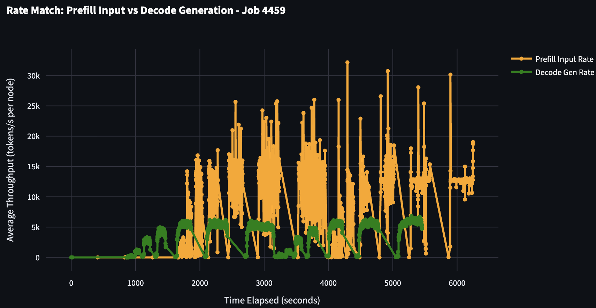
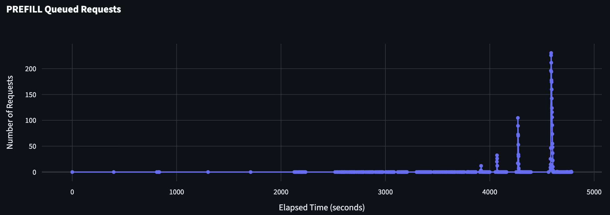

**TLDR:** Deciding how many prefill and decode workers you need in an disaggregated inference setup is difficult. Rate matching is a simple but powerful tool you can use to determine this

# Introduction to rate matching

Disaggregated serving splits the request pipeline into two phases: the prefill phase that processes the prompt and generates KV cache and the decode phase that generates tokens. This architecture is supported in all of the major inference engines and can provide significant performance improvements for certain workloads.

Whenever someon's looking to deploy a model using disaggregation, a common question that comes up is: **how do I know the right number of prefill workers and decode workers to provision**. Because optimal performance is so workload dependent, picking the right ratio is not always straightforward.

The goal of this post is to give a simple, lightweight introduction to rate matching, and outline steps that you can take to figure out the right number of prefill and decode workers for your workload. Note that this is not a comprehensive guide and a production inference deployment with variable input and output sequence lengths will require a more nuanced approach and techniques like dynamic autoscaling and online planning. If this is something you're interested in, checkout out my team's open source work on [Dynamo](https://github.com/ai-dynamo/dynamo)!

If you want a broader intro to disaggregation, this [doc](https://docs.nvidia.com/dynamo/latest/design_docs/disagg_serving.html) is a good high level introduction.

# Gathering a baseline

Before thinking about disaggregation, its important to get an understanding of the current state of the world. You can do this by gathering a simple baseline for your model. The easiest way to do this is collect a benchmark of your model and engine in aggregated mode in a couple different parallelism scenarios. If at any point you realize that disaggregation is not really helping (e.g super small input sequence length), you might be better off serving in aggregated with multiple replicas.

# Isolating Prefill and Decode Performance

Now that we have an aggregated baseline, its important to isolate the performance of the prefill and decode stages alone and get a sense for what peak performance looks like. Aggregated baselines don't show this very well because of prefill injection latency. This is also a good time to dive into your engine setup as well. In order to measure prefill performance, you want to setup a prefill-dominated workload. This means you want to set your input sequence length (ISL) to be similar to your expected request but output sequence length (OSL) to be something small (say 5). When you go to measure decode performance, you want to set your ISL to be something small but reasonable in order to simulate a single prefill step but minimize prefill queuing and set your OSL to be similar to your expected request OSL.

This step will probably take the longest as you will need to tune your engine to get the best performance. Engines like SGLang and TRT-LLM have a variety of flags (chunked prefill, attention backend, mixture-of-experts kernels, etc) that can widely affect performance and its a good idea to setup some sweeping infrastructure to help you figure out the best configs. More often than not, this will require you to dive into the internals of each engine and figure out how each flag plays into the overall performance. This is also a good time to use offline profiling tools like [AIConfigurator](https://github.com/ai-dynamo/aiconfigurator/tree/main) in order to get another data point.

At the end of this step, you should have a set of configurations for peak prefill and peak decode performance. Rate matching is all about reconciling these two.

# Rate Matching

Say you have the following numbers and constraints:

- Your workload has an ISL of 1000 and OSL of 1000 tokens.
- Your best prefill config uses dp-attention and expert parallelism of 8 (DEP8) and peaks at **13k TPS per GPU**.
- Your best decode config uses dp-attention and expert parallelism of 48 (DEP48) and peaks at **9k TPS per GPU**.

Our first step is figuring out how many requests per second each prefill and decode server can handle. Since ISL is 1000, 1000 tokens per second corresponds to 1 request per second. And since we know how many GPUs each server takes, we can easily convert TPS per GPU to TPS per server

- Prefill server throughput: `13k * 8 GPUs = 104k TPS per server`  
  Which is about `104 requests per second` at ISL 1000.
- Decode server throughput: `9k * 48 GPUs = 432k TPS per server`  
  Which is about `432 requests per second` at OSL 1000.

Immediatly we can see that decode is much faster than prefill and prefill is our bottleneck. In this case it makes sense to increase to 3 prefill servers in order to match the decode throughput closer.

You can also take logs of a benchmark where you run 1P vs 1D with your expected ISL and OSL and plot the input tok/s (prefill) vs output tok/s (decode) from each engine. Here's an example graph from SGLang:

Here you can see that decode throughput is not able to keep up with the prefill throughput! Additionally, you can look at the queueing on the prefill side which shows that the single prefill server simply cannot process fast enough to keep the decode busy (which has 0 queued requests at almost all concurrencies)!

Here's an example of an improved rate match:

Here you can see that the decode throughput is much better and is able to start to keep up prefill throughput and the aggregate prefill queue is much smaller!

# Ending thoughts

Rate matching is not always a perfect science and disaggregated serving is a complex problem. Even these steps can be somewhat "hand-wavy" because benchmarking and profiling is still being done offline. I strongly suggest setting up a harness if you do this often (see my SLURM based harness [here](https://github.com/ishandhanani/srtslurm)) and ensure that you are staying organized and collecting the right set of data.
