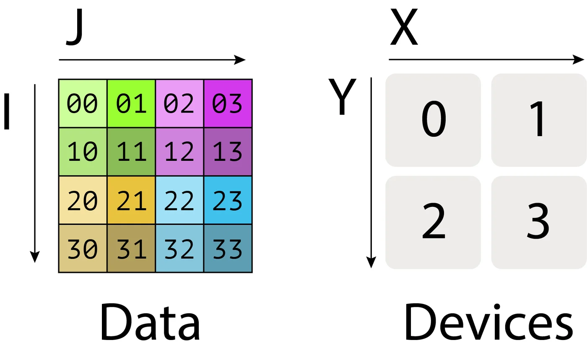
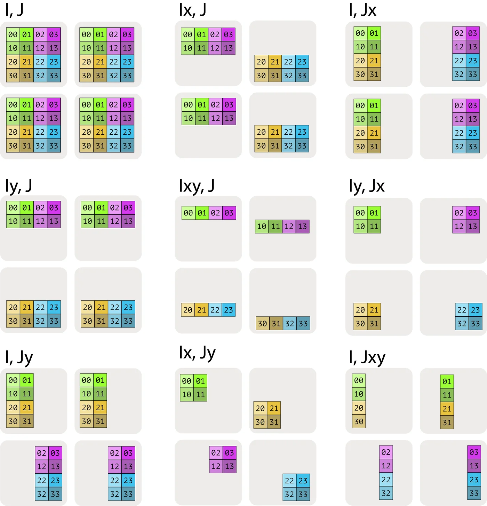
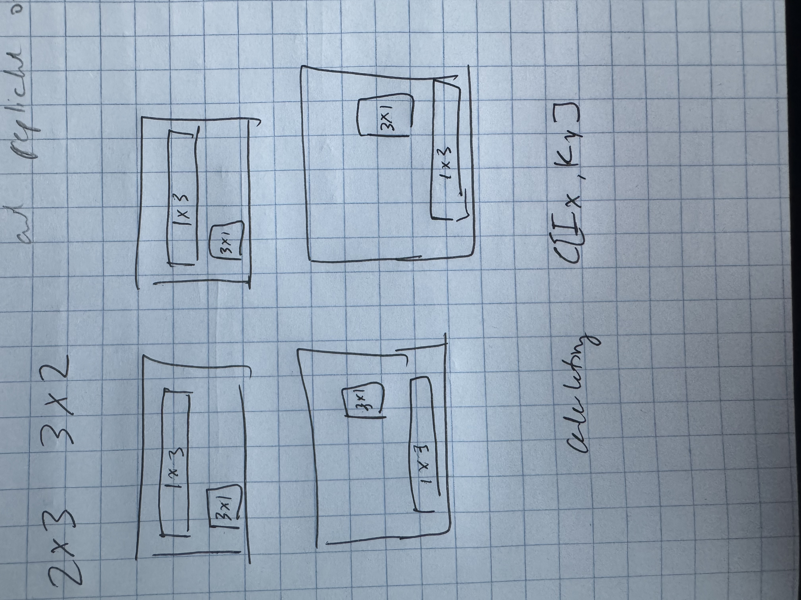

Notes on Tensors, Sharding, and NCCL primatives that are used in distributed training/inference.

# What is a Tensor?

> [!note]
> Notes based on this [excellent blog post](https://blog.ezyang.com/2019/05/pytorch-internals/)

A tensor is an n-dimensional data structure containing some data type. Each tensor contains data and metadata describing the size of the tensor and the elements that it contains (dtype, devices, memory , etc).

<details>
<summary>Basic pytorch tensor creation</summary>

```python
import torch

# create a 1D, 2D and 3D tensor
# 1D tensor
a = torch.tensor([1, 2, 3])
# 2D tensor
b = torch.tensor(
        [[1, 2, 3],
         [4, 5, 6]]
)

# 3D tensor
c = torch.tensor(
        [[[1, 2, 3],
          [4, 5, 6]],
         [[7, 8, 9],
          [10, 11, 12]]]
)

print(a.shape)
print(b.shape)
print(c.shape)

# torch.Size([3])
# torch.Size([2, 3])
# torch.Size([2, 2, 3])
```

</details>

<details>
<summary>Tensor strides</summary>

Tensors are math concepts but they need to have a physical representation in memory. The most common way is to represent this as a contiguous block of memory. As in write out each row into memory. So if each tensor is `int32` (4 bytes) and we have a 2D tensor `[[1, 2], [3, 4]]` then the memory layout would be `[1, 2, 3, 4]` with each value offset 4 bytes. If I want to access element at position `tensor[1, 0]` (3) - how do I translate this logical position to a physical position? Strides help here. To figure out where any element lives, multiply each index with respective stride for that dimension and sim together. You can find stride of an array by calling `tensor.stride()`. This is how PyTorch gives us views of a tensor.

</details>

# Sharding Tensors

We can shard a tensor across multiple devices. Look back at the previous blog post on [multi-node matmuls](./flops-intensity-rooftline.md#multi-gpunode-communication) for a review if needed. If a matrix is of size `[I,J]` and we want to share it across 4 devices evenly, we can say that each device will have a **local shape** of `[I//2,J//2]`.

## Notation for sharding

Assume there is a 2D or 3D grid of devices called a `device mesh` on axis X, Y, (Z...). We can specify how tensor data is split across the devices in the mesh.

- Sharding: $A[I_x, J_y]$ tells us to share the first axis $I$ (rows) across mesh axis $X$ and the second axis $J$ (columns) across mesh axis $Y$. Each shard holds $\frac{1}{|X| \cdot |Y|}$ of the tensor
- Mesh - we have 4 devices in a 2x2 grid with axis names X and Y



If you think of data parallelism - we fully replicate `A[I,J]` across all devices.

We can chop up the tensor in many different ways. Below is a picture that describes this.



Here's some code below that shows these 9 examples.

<details>
<summary>Sharding code</summary>

```python
import torch

def shard(X: torch.Tensor, row_mesh: str, column_mesh: str, mesh_x_axis: int, mesh_y_axis: int):
    """
    Shard the input arrays X and Y based on the specified mesh axes. The mesh
    axis indicate our device mesh. So a mesh_x_axis of 2 and a mesh_y_axis of 2
    means that we have a device mesh of

    [
      [d1, d2]
      [d3, d4]
    ]

    Parameters:
    - X: np.ndarray, input array to be sharded.
    - mesh_x_axis: int, axis along which to shard X.
    - mesh_y_axis: int, axis along which to shard Y.

    Returns:
    - tuple of np.ndarray: Sharded arrays (X_shard, Y_shard).
    """

    # Validate inputs
    assert isinstance(X, torch.Tensor), "X must be a torch.Tensor"
    assert row_mesh in ["X", "Y", "XY", None], "row_mesh must be 'X' or 'Y' or None or 'XY'"
    assert column_mesh in ["X", "Y", "XY",  None], "column_mesh must be 'X' or 'Y' or None or 'XY'"
    assert isinstance(mesh_x_axis, int) and mesh_x_axis >= 0, "mesh_x_axis must be a non-negative integer"

    # Determine row shards
    # If we provide X - then we have # mesh_x_axis shards
    # If we provide Y - then we have # mesh_y_axis shards
    # If we provide XY - then we will have mesh_x_axis * mesh_y_axis shards
    if row_mesh == "X":
        num_row_shards  = mesh_x_axis
    if row_mesh == "Y":
        num_row_shards  = mesh_y_axis
    if row_mesh == "XY":
        num_row_shards  = mesh_x_axis * mesh_y_axis
    if row_mesh is None:
        num_row_shards = 1

    # Determine column shards
    if column_mesh == "X":
        num_column_shards = mesh_x_axis
    if column_mesh == "Y":
        num_column_shards = mesh_y_axis
    if column_mesh == "XY":
        num_column_shards = mesh_x_axis * mesh_y_axis
    if column_mesh is None:
        num_column_shards = 1

    # Tensor shape
    num_rows = X.shape[0]
    num_columns = X.shape[1]

    rs = num_rows // num_row_shards
    cs = num_columns // num_column_shards

    for i in range(0, mesh_x_axis):
        for j in range(0, mesh_y_axis):
            print(f"shape of matrix in x-axis {i} and y-axis {j} is {rs}, {cs}")
            print()


# create a 4,4 tensor
X = torch.tensor([[0., 1., 2., 3.],
                  [10., 11., 12., 13.],
                  [20., 21., 22., 23.],
                  [30., 31., 32., 33.]])


# there are 9 possible combinations. Validate all
# we cannot have the same row and column mesh or cannot have X and XY or Y and XY
for row_mesh in ["X", "Y", "XY", None]:
    for column_mesh in ["X", "Y", "XY", None]:
        if row_mesh == column_mesh and row_mesh is not None and column_mesh is not None:
            continue
        if (row_mesh == "X" and column_mesh == "XY") or (row_mesh == "Y" and column_mesh == "XY"):
            continue
        if (row_mesh == "XY" and column_mesh == "X") or (row_mesh == "XY" and column_mesh == "Y"):
            continue
        print(f"Testing with row_mesh={row_mesh}, column_mesh={column_mesh}")
        shard(X, row_mesh, column_mesh, 2, 2)
        print()
```

</details>

TLDR - when you see the subscript in say `A[I_x, J]` you know that I (row dim) is being sharded evenly across the X axis of a mesh (so if X=2 then there are 2 shards of I). If the subscript isn't there then you're not sharding across but instead duplicating across that axis.

**Definition**: The **contracting dimension** is what appears in both mats and is summed over during multiplication.

# Computation across sharded arrays

1. For element-wise operations there is no need to communicate
2. For operations across elements we require communication

Let's look at: $A[I_x, J] * B[J, K_y] \Rightarrow C[I_x, K_y]$. Assume a 2×2 mesh. And assume $I=2$, $J=3$, $K=2$ for simplicity. Visuals always help me understand better so here's a rough picture. Because of how we've set this up - we actually don't need to do any communication at all since our contracted dimension (J) is not sharded.



## 4 cases for sharding

1. Neither input matrix is sharded across the contracted dimension. No communication required.
2. One input is sharded across contracted dimension. We typically `AllGather` the sharded input along the contracting dimension
3. Both input matricies are sharded across contracted dimension. We multiply local shards then `AllReduce` the result.
4. Both input matricies have a non-contracted dimension sharded along same axis. We cannot proceed without an initial `AllGather` of either input first.

### Case 1
